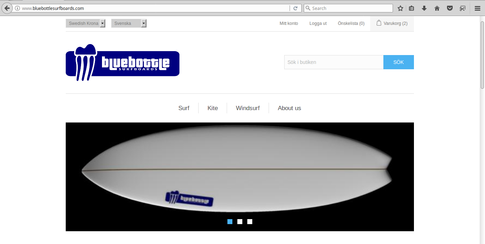
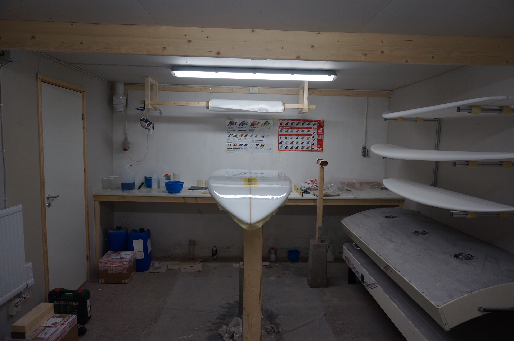

# Bluebottle surfboards
I det här avsnittet ges lite bakgrundsinformation till Bluebottle surfboards som vi kommer att använda som ett case study under kursen. Bluebottle surfboard består dels av en webbsajt, dels av en fysisk fabrik. Även om det är en verklig sajt så är verksamheten vilande och det är få eller inga verkliga besökare på sajten så vi kommer istället att använda simulerade (virtuella) användare. Fördelen med detta är att vi (eller åtminstone jag) faktiskt vet hur olika användare beter sig och varifrån de kommer. Under kursens gång kommer det att vara er uppgift att försöka ta reda på detta genom att analysera data i google analytics och andra verktyg… 

## Bluebottle surfboards demosajt 

Några känner kanske igen den ifrån webbanalys-kursen där vi använde den för att lägga till spårningskod för Google Analytics e-commerce tracking. Sajten används bara i test/demosyfte och under kursen kommer alla att få tillgång till sajten Google Analytics-konto. Det är också fritt fram att testa runt på sajten och registrera konton eller beställa brädor för att t.ex. se vilken data som skickas till Google Analytics utan att man riskerar att det kommer några brädor på posten... 

## Bluebottle surfboards fysiska butik

Förutom sajten tänker vi oss att det också finns en fabrik/butik där man fysiskt kan åka och titta på brädorna samt även köpa dem. Under kursen kommer vi att titta på hur man kan knyta ihop köpen som görs i den fysiska butiken med köp som görs på sajten.

# Marknadsföring

I nuläget finns det ingen marknadsföringsstrategi eller pågående kampanjer för Bluebottle Surfboards. 

Under kursen kommer vi att tillsammans titta på hur man samlar in data från kampanjer i olika kanaler och hur man genom att analysera denna kan ta fram en strategi för den fortsatta marknadsföringen. Även här kommer vi att använda oss av virtuella användare för att generera data som vi sedan kan analysera, istället för att sätta upp riktiga kampanjer vilket kan vara både kostsamt och tidskrävande.

Vi kommer att titta på marknadsföringskanaler som nyhetsbrev och sociala medier som facebook, och kommer även att beröra annonsering i olika mobila appar, t.ex. väderappar eftersom många av kunderna antas använda sådana. Slutligen tittar vi också på hur man kan hantera gammelmedia, om man t.ex. vill annonsera i en tryckt surftidning. 

