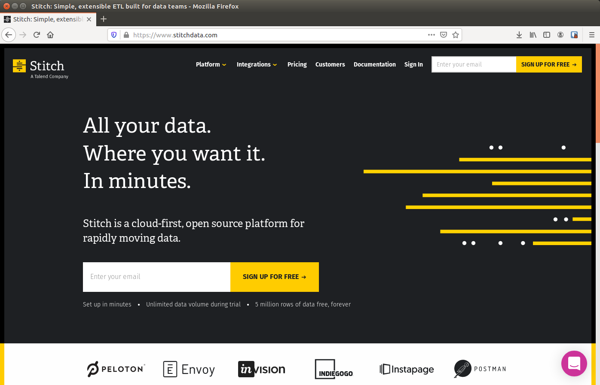
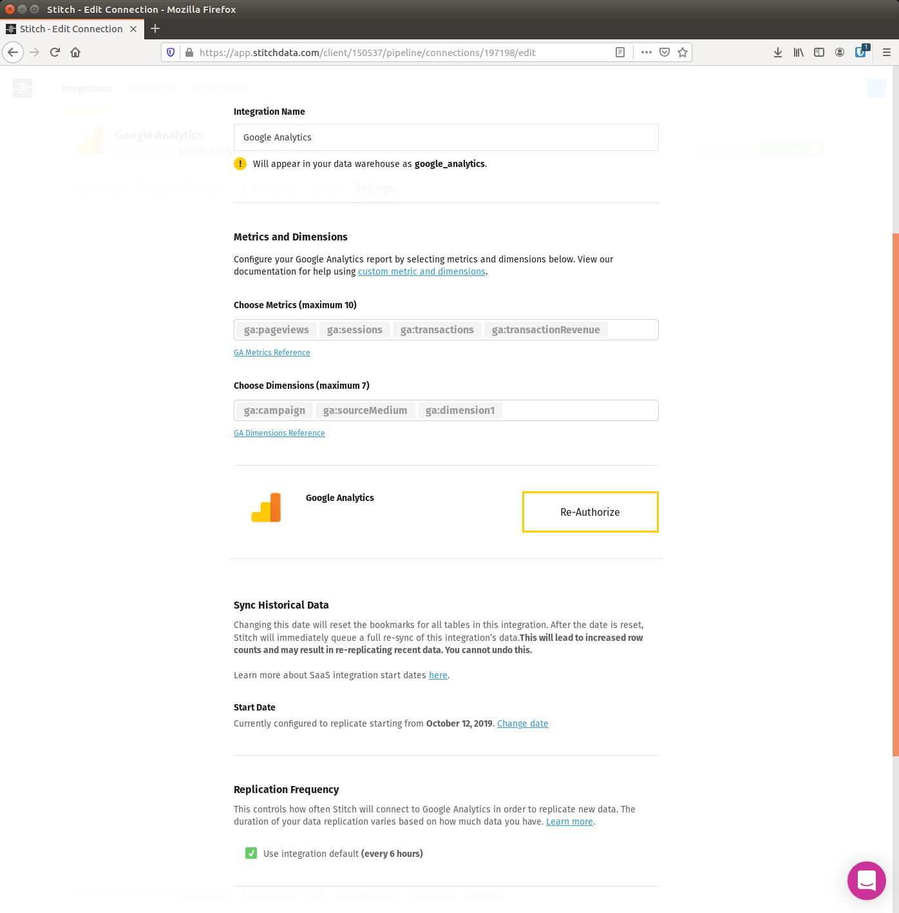
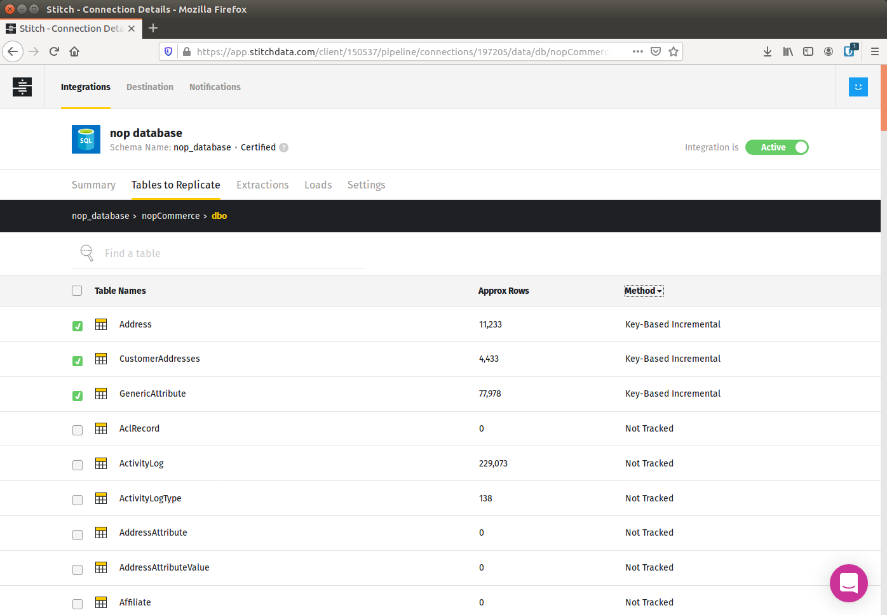
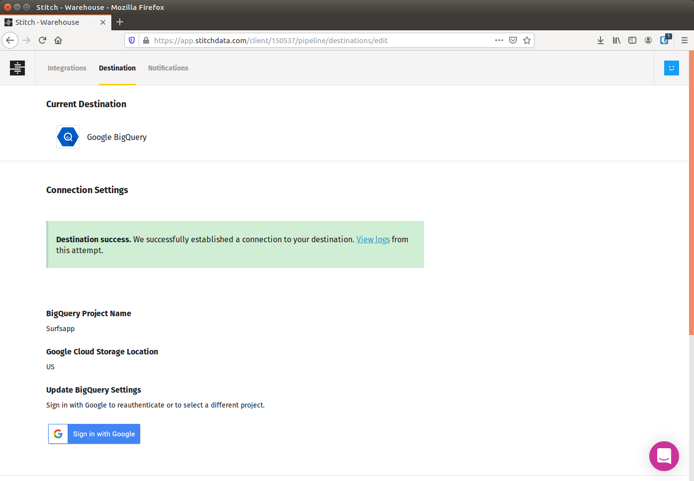

# Data warehousing

Data warehousing handlar om att samla all analysdata i en gemensam databas. I det här avsnittet går vi igenom hur man kan samla sin data i BigQuery som är Googles datawarehouse. 

## Google Analytics data

Vanliga Universal Analytics (inte 360 varianten) har ingen inbyggd integration till BigQuery. Istället erbjuder den ett reporting API som gör det möjligt att läsa ut data från Google Analytics och in i andra system. Detta använts t.ex. för att läsa över data från Google Analytics till Google Sheets samt till Data Studio eller Power-BI. Stitchdata har tagit fram ett verktyg som kan läsa ut data från Google Analytics reporting API och skicka denna till bland annat BigQuery:

https://www.stitchdata.com/

Vi har gått igenom hur man sätter upp detta under lektionstid och nedan är en bild på den integration som vi då satte upp:

Google Analytics reporting API är ganska begränsat vad gäller hur många dimensioner och metrics som man kan använda sig av, och dessutom rör det sig om aggregerad data och inte rådata på hit-nivå, men vi kan ändå dra nytta av fördelar som att enkelt kunna koppla ihop vår Google Analytics data med andra datakällor och att enkelt kunna visualisera vår data i t.ex. Data Studio.

## CRM-data

För att få någon data att knyta ihop vår Google Analytics data med satte vi även upp en integration mot vår CRM-databas med hjälp av Stitch:

Slutligen konfigurerade vi stitchdata för att skicka all data till vårt Data Warehouse i BigQuery:

