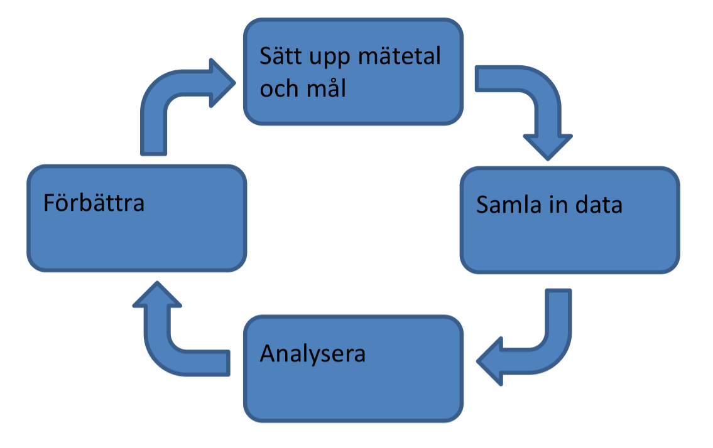
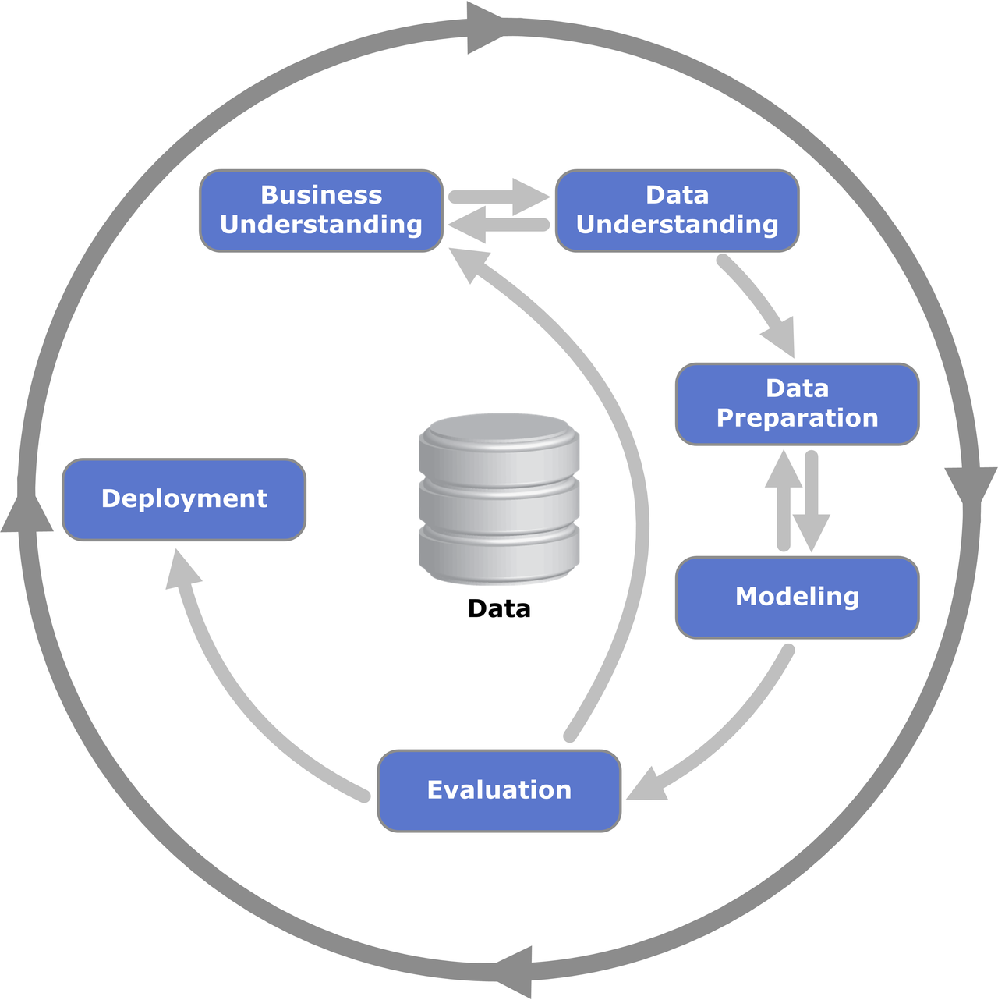

# Process för dataanalys

Från tidigare kurser har ni redan fått med er en rejäl verktygslåda för att lösa olika uppgifter inom digital analys. För att tillämpa dessa verktyg på ett effektivt sätt är det viktigt att man strukturerar sitt arbete och följer en process. Det finns en mängd olika processer som man kan använda, men gemensamt för dessa är att de är iterativa. Istället för att försöka samla in all data som kan behövas för att kunna svara på alla tänkbara frågor i en organisation så börjar man med den data som finns tillgänglig och analyserar denna. Denna analys ger sedan upphov till både insikter om förändringar i t.ex. marknadsföring eller utformning av erbjudande, behov av ny data, samt nya frågeställningar. Genom att utföra förändringarna och samla in ny data kan man sedan genomföra en ny djupare analys.

## Förenklad process

Den enklaste formen av process, som ni antagligen redan har använt i de tidigare kurserna, är att man helt enkelt sätter upp ett antal mål, samlar in tillgänglig data, analyserar denna, och sedan ger ett antal förbättringsförslag (eller eventuellt genomför dessa). Denna process kan sammanfattas i följande steg:

1. Sätt upp mål och mätetal
2. Samla in data
3. Analysera
4. Genomför

Ofta låter man tiden för en iteration vara tidsbestämd, t.ex. 2 veckor. 

Exakt vilka mål och mätetal, samt vilken data som skall analyseras i vilken iteration beror naturligtvis helt på vilka behov ett företag har samt hur långt de har kommit i sin digitala resa. 

Det finns dock en del rekommendationer för hur man stegvis kan införa en effektiv datainsamlig i en organisation. En sådan är ”The ladder of pain / steps to nirvana” av Avinash Kaushik. 

Dessa steg har ni troligtvis gått igenom i webbanalyskursen. Under de första veckorna av den här kursen kommer vi att återbesöka dessa steg, men fördjupa oss lite mer i hur man kan hantera dessa i fallet där man har flera kanaler samt även titta på hur man statistiskt kan säkerställa resultaten från sin analys.

## CRISP-DM

Under den andra delen av kursen kommer vi att titta man kan hantera ofullständiga krav, rådata, samt använda machine learning och mer avancerade statistiska modeller i sin dataanalys. 

I de här fallen kan det ofta vara till hjälp att använda en lite mer detaljerad process för att strukturera upp arbetet med dataanalysen. En vanligt förekommande process i sådana sammanhang är CRISP-DM (https://en.wikipedia.org/wiki/Cross-industry_standard_process_for_data_mining). CRISP-DM innehåller följande steg:

1. Business understanding
2. Data understanding
3. Data preparation
4. Modeling
5. Evaluation
6. Deployment

Som bilden antyder är inte enbart processen i sig iterativ, utan det förekommer även flera iterationer mellan de olika stegen inom varje iteration av processen. 

### Steg 1: Business understanding / Sätt upp mål

Det första man behöver göra innan man sätter igång med ett uppdrag är att definiera exakt vad det är för problem man vill lösa och specificera målen på ett sådant sätt att man tydligt kan avgöra när dessa är uppfyllda. Man pratar ofta om sätta upp SMARTa mål, d.v.s. mål som uppfyller följande (https://sv.wikipedia.org/wiki/SMART_(m%C3%A5lformulering))

- Specifikt, tydligt och konkret, exempel äta näringsrik frukost varje morgon.
- Mätbart, tid, kvantitet och kvalitet, exempel varje frukost ska innehålla det jag har beskrivit i målet.
- Accepterat, Jag vill göra det.
- Realistiskt, det är möjligt att göra detta för mig.
- Tidssatt, realistisk tidsram, exempel jag ska uppnå mitt kortsiktiga mål om 2 veckor och mitt långsiktiga inom 5 veckor. 

### Steg 2: Data understanding / Utforska data

När vi har satt upp ett tydligt mål för uppdraget behöver vi försäkra oss om att vi har tillgång till den data som behövs för att utföra detta. När vi jobbar med data från flera olika kanaler behöver vi ofta tillgång till flera olika datakällor. 

Vi behöver också utforska vår data. Börja med att ge en övergripande bild av vilken typ av data som vi har tillgång till, hur stor datamängd vi har, och gör en enklare statistisk analys av de olika parametrarna.

Utforska enklare samband mellan olika parametrar.

Kolla på kvaliteten på vår data. Har parametrarna alltid värden eller finns det mycket hål i vår data?

### Steg 3: Data preparation / Förbered data

Välj ut den data som vi vill använda och städa denna om det finns hål eller andra kvalitetsproblem.

Beroende på vilka modeller som skall användas kan vi även behöva normalisera och linjärisera vår data.

Skapa eventuell dummy-data som behövs för våra modeller eller beräknade variabler.

Slå ihop data från olika källor genom att använda gemensamma nycklar. Beräkna aggregerad data om det behövs.

### Steg 4: Modeling / Ta fram modeller

Välj modelleringsteknik. Skall vi t.ex. utföra en regression eller en klassificering? 

Använd statistiska metoder och/eller machine learning för att visa på sambandet mellan olika parametrar och olika nyckeltal. Kan vi statistiskt visa att vissa segment presterar bättre alternativt sämre än ändra?  
 

### Steg 5: Evaluation / Utvärdera resultat

Finns det ett orsakssamband (kausalitet) mellan parametrarna och affärsmålet? Vilka parametrar har störst påverkan? 

Ta fram en lista med insikter och förbättringsförslag. 

## Step 6: Deployment / Genomförande

Ta fram en strategi eller handlingsplan för hur förbättringsförslagen skall verkställas. 

Ta fram en plan för hur man kan mäta och övervaka att förändringarna ger avsedd effekt.

Ta fram en slutrapport eller presentation.

