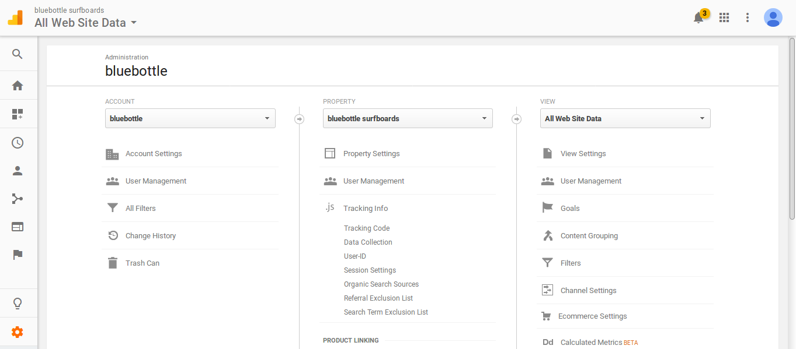
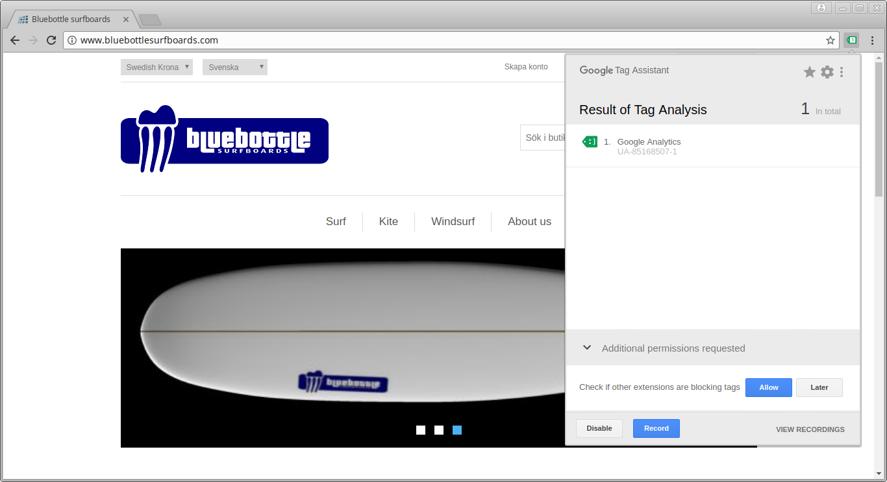
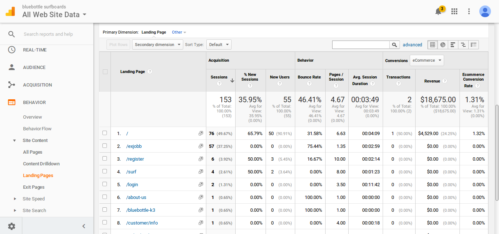
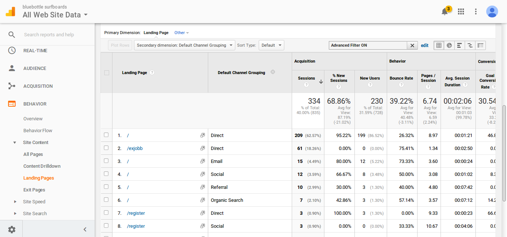
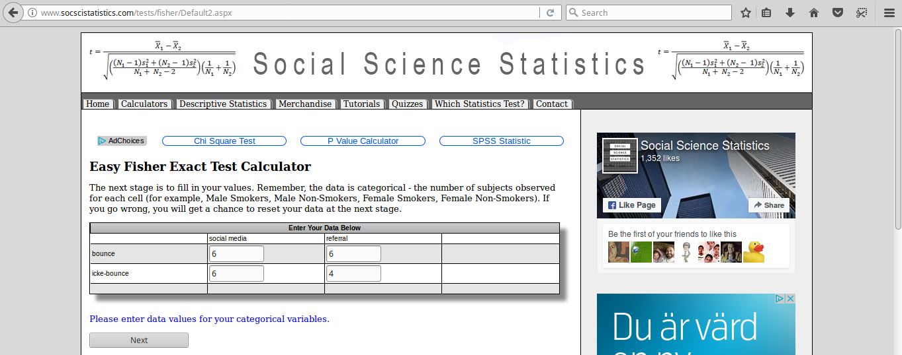
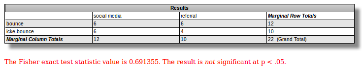
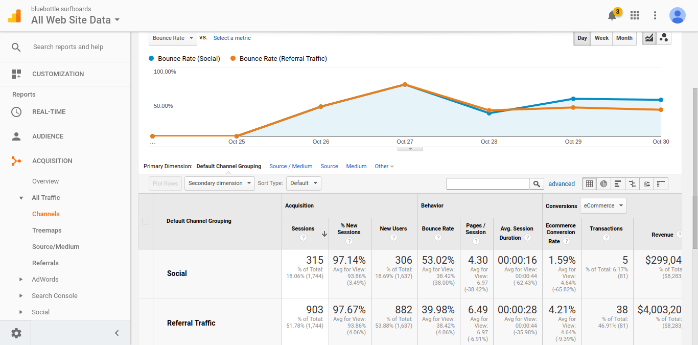
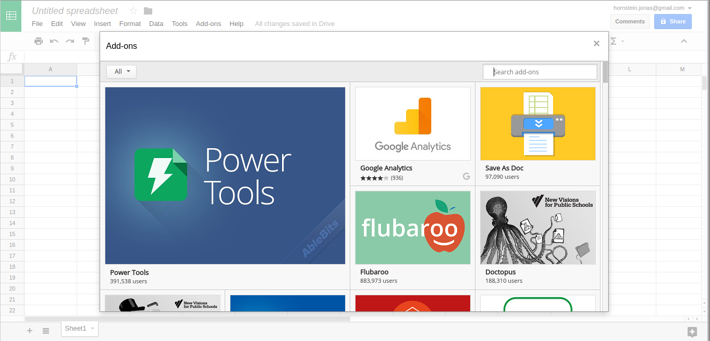
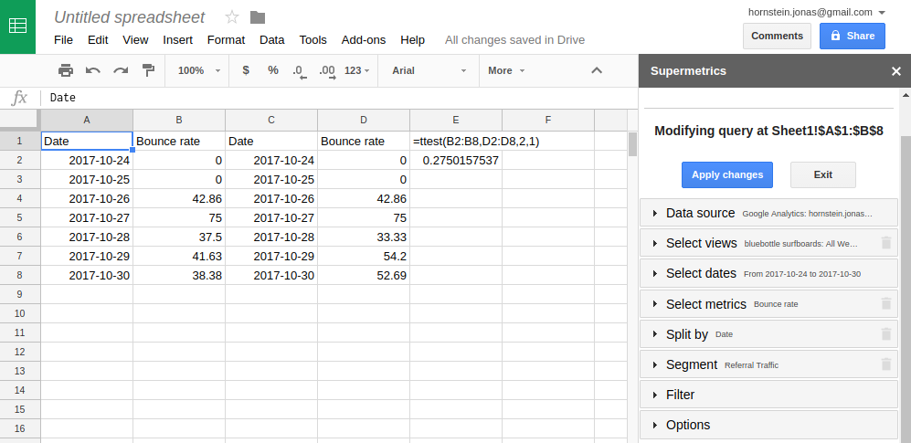

# Steg 1: Implementera taggar

Inga taggar - ingen data, så låt oss börja från början och sätta upp Google Analytics Pageview-tag. För att göra detta behöver vi en webbsajt och ett Google Analytics konto. 

## Google Analytics Tracking code

Logga in på Google Analytics, skapa upp ett konto för företaget (i vårt fall Bluebottle) samt en property för den aktuella sajten (i det här fallet www.bluebottlesurfboards.com).

Under vår property hittar vi en länk till ”Tracking code” som innehåller det javascript som vi 
behöver lägga till i headern på vår sajt för att börja skicka Pageview-data till Google Analytics.



Klickar vi på Tracking Code får vi upp följande javascript:

```html
<!-- Global site tag (gtag.js) - Google Analytics -->
<script async src="https://www.googletagmanager.com/gtag/js?id=UA-85168507-1"></script>
<script>
  window.dataLayer = window.dataLayer || [];
  function gtag(){dataLayer.push(arguments);}
  gtag('js', new Date());

  gtag('config', 'UA-85168507-1');
</script>
```

  
Den uppmärksamme läsaren kanske noterar att tracking coden ser annorlunda ut nu än vad den gjorde under Webbanalys-kursen. Detta beror på att Google Analytics har kommit ut med ett nytt tracking-script gtag.js som ersätter tidigare analytics.js. Det går dock fortfarande bra att använda analytics.js (och även den ännu äldre ga.js). Så länge vi får in data i Google Analytics så behöver vi dock inte gräva ner oss alltför mycket i de tekniska detaljerna.

Bluebottle surfboards webbsida är byggd på e-handelsplattformen nop-commerce som har ett plugin för Google Analytics. Detta är fortfarande inte uppdaterat till gtag.js så vi kommer därför att fortsätta att köra analytics.js i den här kursen:

```html
<!-- Google Analytics -->
<script>
(function(i,s,o,g,r,a,m){i['GoogleAnalyticsObject']=r;i[r]=i[r]||function(){
(i[r].q=i[r].q||[]).push(arguments)},i[r].l=1*new Date();a=s.createElement(o),
m=s.getElementsByTagName(o)[0];a.async=1;a.src=g;m.parentNode.insertBefore(a,m)
})(window,document,'script','https://www.google-analytics.com/analytics.js','ga');
ga('create', 'UA-85168507-1', 'auto');
ga('send', 'pageview');
</script>
<!-- End Google Analytics -->
```

Man hittar det gamla scriptet på: 

https://developers.google.com/analytics/devguides/collection/analyticsjs/ 

Ok, vi antar att vi nu klistrat in scriptet antingen direkt i html-koden, eller som i vårt fall i ett plugin. Låt oss testa att det fungerar. Detta kan man göra antingen via Google Tag Assistent eller direkt i Google Analytics realstidsvy (i övriga vyer tar det som bekant några timmar innan data finns tillgänglig).



Data ser ut att skickas korrekt till Google Analytics. Vad är det för information som vi kan få ut ifrån denna? Faktiskt ganska mycket, t.ex:

- Page Views
- Unique Visitors
- Time on Site
- Referrers
- mm

Vad kan vi göra med denna informationen? Vi kan använda denna för att göra en första utvärdering av sajten samt våra potentiella marknadsföringskanaler. 

## Analysera Bounce rates för top landing pages

Avinash Kaushik föreslår att det första man skall göra är att titta på Bounce Rates för Top Landing Pages. Bounce rate betyder hur stor andel av besökarna som kommer in på en viss sida som lämnar sajten direkt. En hög bounce rate betyder i de flesta fall att användarna inte hittar det de söker, vilket kan bero på att det antingen är något fel på sidan eller att användarna hade fel förväntningar i förhållande till vad vi erbjuder. 

Låt oss därför börja med detta. Vi hittar bounce rates för landningssidorna i Google Analytics under Bahavior – Landing Pages:



I Google Analytics kan vi se att det finns två huvudsakliga landningssidor:

- www.bluebottlesurfboards.com/
- www.bluebottlesurfboards.com/exjobb

Den första fungerar relativt bra (32% bounce rate) medan den andra fungerar betydligt sämre (75% bounce rate). Surfar man till dessa så är det ganska uppenbart varför den andra fungerar så dåligt…


## Segmentera besökare

Ett av de viktigaste verktygen när man vill analysera sina besökare är att segmentera dessa, d.v.s. dela in dem i mindre grupper. Det som kännetecknar en bra segmentering är att de olika grupperna har olika beteenden. 

Segmenterar man t.ex. efter webbläsare och upptäcker att beteendet är ungefär likadant oavsett vilken webbläsare som används så är det inte mycket man kan göra med den insikten. Skulle man däremot upptäcka att de med t.ex. Safari har en mycket högre bounce rate så är det ju intressant att undersöka om sajten verkligen fungerar som den skall i Safari. 

För att ett segment skall vara intressant ur marknadsföringssynpunkt vill man dessutom att det finns ett sätt att rikta marknadsföringen specifikt till de olika grupperna. När vi jobbar med multi channel kan det ju vara olika beroende på kanal. Annonserar vi på webben kan det ju finnas möjlighet att styra reklamen så att den inte visas för de med Safari webbläsare, medan en fysisk reklamplats kanske är enklare att rikta geografiskt så att en segmentering utifrån geografi hade varit mer intressant (förutsatt att den också ger upphov till grupper med olika beteenden).

Nu är ju det här en kurs i multikanalsanalys så vad kan vara mer intressant än att segmentera utifrån just kanaler? 



Här har jag valt att segmentera utifrån Default Channel Grouping (jag har visserligen inte använt segmenteringsfunktionen utan istället lagt DCG som en secondary dimension). 

Vi kan se att Bounce raten är högst från email, följt av organisk sök och sociala medier. Lägst bounce rate har vi för direkttrafik och referral. Direkttrafik är ju lite svår ur ett marknadsföringsperspektiv, men referral kan ju vara intressant att gräva vidare i. Vilka referrals finns det? Kan vi göra mer för att öka vår närvaro på dessa? Går det t.ex. att marknadsföra sig med en banner på dessa sidor?

När det gäller kanaler med hög bounce rate så kanske vi inte skall köra mer av samma på dessa utan först försöka förstå varför vi får hög bounce rate och jobba mer på innehållet innan vi marknadsför oss i dessa. 


## Signifikanstestning
 
Antag att Bluebottle Surfboards funderar på att börja marknadsföra sig antingen på ett socialt nätverk eller på sina referrals. Utifrån en datadriven analys ligger det nära till hands att rekommendera att man satsar på referral då dessa användare har lägre bounce rate ovan, men är denna skillnad statistiskt säkerställd? Innan vi ger en rekommendation så bör vi kontrollera att det rör sig om en statistiskt säkerställd skillnad och inte bara en slumpmässig variation.

Vi sätter därför upp en noll-hypotes med antagandet att bounce-raten är samma för besökare som kommer från social media och för besökare som kommer via en annan referral. 

Har vi tillräckligt med data så kan vi se vår parameter som en binomial distribution där ett besök antingen resulterar i en bounce eller en icke-bounce och använda ett oberoende t-test för att undersöka om vi kan förkasta noll-hypotesen eller inte. I exemplet ovan har vi dock väldigt få observationer (6 bounce och 6 icke-bounce för social media, respektive 4 bounce och 6 icke-bounce för referral). I det här fallet är det därför bättre att använda sig av t.ex. Fisher’s exakta test. Till skillnad från t-test som finns implementerat i de flesta kalkylprogram (t.ex. Excel, Libre Calc, och Google spreadsheet) så kräver Fisher’s test ofta att man använder ett scriptspråk som R eller Python alternativt att man använder ett separat verktyg.

Ett enkelt online-verktyg för Fisher’s test finns på:

http://www.socscistatistics.com/tests/fisher/Default2.aspx 





Tyvärr visar testet att skillnaden inte är signifikant. I nuläget bör vi alltså samla in mer data innan vi med säkerhet kan säga något om skillnaden i bounce rate för de olika kanalerna...

En lite mer generell metod för att testa om vi har en signifikant skillnad mellan mätvärden för olika segment i Google Analytics är att titta på hur dessa skiljer sig över tid. Låt oss t.ex. titta på bounce raten för de olika kanalerna under den senaste veckan:



Jämför vi mätvärden över samma datumintervall så kan vi använda ett parat t-test. För att göra det behöver vi få läsa över mätvärdena i ett kalkylprogram. Här kommer vi använda oss av Google Spreadsheet som erbjuder två plugin för att läsa ut data från Google Analytics, dels Googles officiella plugin och dels ett plugin från Supermetrics. Det senare är lite enklare att använda så vi installerar det genom att klicka Add-ons – Get add-ons…, och söka efter Supermetrics.



I pluginet kan vi ställa in vilket konto och vilken vy vi vill hämta data ifrån, samt välja datumintervall (senaste veckan), metrics (bounce rate), hur vi vill dela upp vår data (utifrån datum), samt hur vi vill segmentera denna. Nedan har jag först gjort segmentering utifrån Referral traffic i rutan A1 och sedan läst in samma data segmenterad utifrån Social i C1.

När vi läst in vår data kan vi skapa upp ett tvåsidigt parat ttest genom att skriva `=ttest(B2:B8,D2:D8,2,1)`. Resultatet av detta blev 0.275, alltså fortfarande ingen signifikant skillnad i bounce rate mellan trafik från referrals och social media.



Dessa två metoder så räcker gott för den här kursen och de flesta situationer i arbetslivet… 