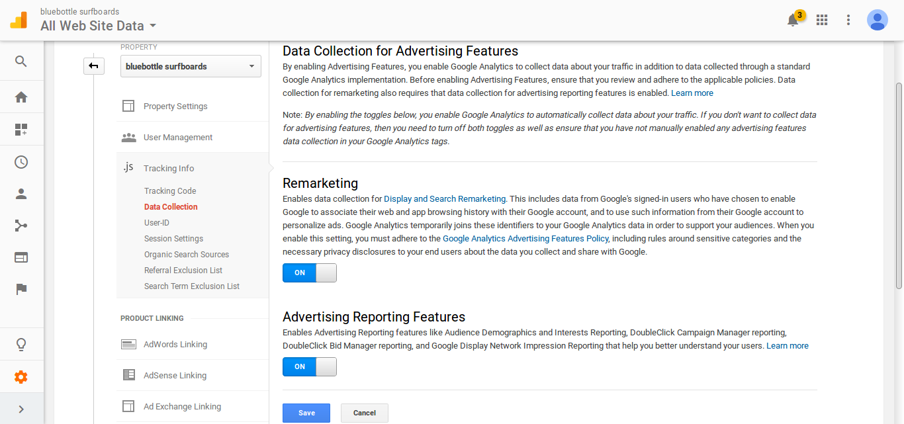

# Steg 2: Konfigurera Google Analytics

Medan vi väntar på att vårt Google Analytics konto fylls på med mer data så kan vi passa på att konfigurera verktyget. Detta är också det andra steget i trappan.

## Google Search Console

Det första man vill konfigurera i Google Analytics är troligtvis att slå på Search Console. Utan att slå på search console får vi ingen data om vilka sökord som används vid organisk sök (i all fall inte från Google).  

Vi hittar inställningen för Search Console under vår property i Google Analytics admin-vy.

Här behöver vi klicka på Add och blir då förflyttade till Search Console där vi behöver lägga till vår Property och verifiera denna. Sedan behöver vi gå tillbaka till Google Analytics, klicka Add igen och välja sajten i den lista som nu finns där, och slutligen klicka Done. Det här brukar strula så kolla upp detta om ni är ute på ett företag som inte är så vana att arbeta i Google Analytics. När det fungerat skall det se ut som nedan:

## Remarketing

I den här kursen kommer vi att gå igenom remarketing, d.v.s. hur man marknadsför sig mot personer som redan varit inne på sidan tidigare.

Google Analytics är som bekant väl integrerat med AdWords och även med DoubleClick Bid Manager. Den senare är dock bara tillgänglig för de med Google Analytics 360-konto. Det är därför osäkert om vi kommer att använda den här integrationen under kursen, men när vi ändå är inne och sätter upp kontot så skadar det ju inte att se till att det finns uppsatt.

Vi slår därför på Remarketing och Advertising Reporting Features under Propety settings – Tracking Info – Data Collection.

## Demografisk data

Har man slagit på remarketing data så skall man även få demografisk data insamlad via Googles Doubleclick-cookie, men man kan också slå på denna separat under Property settings i admin-vyn. Genom att slå på insamling av demografisk data går man också med på att de får ta del av den data man själv skickar upp till Google Analytics och att Google får använda denna för att bättre kunna styra annonser till våra användare (även när de är på andra sajter).

 
## Konfigurera mål

Den sista konfigureringen vi vill göra innan vi analyserar vidare är att sätta upp mål i Google Analytics. I Google Analytics finns det fyra typer av mål:

Destination (konverterar när en viss sida besöks, t.ex. thanks.html)
Duration (konverterar om en besökare stannar på sidan en viss tid, t.ex. 5 min eller mer)
Pages/Screens per session (konverterar om ett visst antal sidor besöks, t.ex. minst 3 sidor)
Event (konverterar om ett specifikt event inträffar, t.ex. en video spelas upp)

Den sista typer av mål kräver att man har lagt in kod på sajten som skickar event-data till Google Analytics. Då vi inte har gjort detta i nuläget så får vi använda oss av de 3 första målen.

Kom ihåg att använda en viss försiktighet med mål som mäter ”engagement”, d.v.s. duration och pages per session. Att en användare stannar länge på sajten och besöker många sidor ses oftast som något positivt, men det kan ju också betyda att de har svårt att hitta det som de söker så vill man verkligen mäta vad användarna tycker om sajten så är det bättre att använda kvalitativa metoder som användarundersökningar.

Destinationsmål är däremot enkla både att sätta upp och analysera. För Bluebottle Surfboards skulle vi t.ex. kunna använda dessa för att mäta hur många användare som registrerar sig och hur många användare som genomför ett köp.

- Målsida för registrering är http://www.bluebottlesurfboards.com/registerresult/1
- Målsida för köp är http://www.bluebottlesurfboards.com/checkout/completed/ 

Målsidorna hittar man enklast genom att manuellt genomföra en registrering och ett köp på sajten och kolla vilket sida man hamnar på.

Nedan har vi satt upp ett mål för att mäta registreringar. Notera att målen sätts för respektive vy och inte på propertyn. 

Här har vi förutom målsidan /registerresult/1 även skapat upp en funnel för att få bättre koll på var i registreringsprocessen som vi eventuellt tappar användare. För att i demonstrationssyfte få en lite längre funnel har vi startat redan när användaren går in på startsidan vilket man normalt inte gör utan registreringsflödet bör starta när man går i på /register… 

Man kan även sätta ett ekonomiskt värde på konverteringen. Detta är viktigt om man t.ex. vill kunna beräkna ROI för sina markandsföringskampanjer. För Bluebottle Surfboards kommer vi istället använda oss av e-handelstracking och det är därför mer intressant att räkna på ordervärdet så vi bryr oss därför inte om att sätta något ekonomiskt värde på själva registreringen.

## Skapa dashboard

När vi nu har satt upp mål så vill vi naturligtvis analysera i vilket utsträckning som dessa uppfylls. Detta kan naturligtvis göras direkt i Google Analytics målvy. Nedan visar vi vår funnel för registreringssidan:

Målkonverteringar och andra KPI:er är dock mätvärden som ofta är av stort intresse för hela organisationen och inte bara de som sitter med Google Analytics. Det är därför vanligt att man skapar upp en dashboard där man samlar alla KPI:er och gör dessa tillgängliga för alla intressenter inom organisationen. Det går visserligen att skapa upp dashboards direkt i Google Analytics, men det är ofta bättre att använda ett separat verktyg som Google Data Studio eller Microsoft Power Bi. Även kalkylprogram som Google Spreadsheet och Excel (med Power Pivot) kan vara lämpliga verktyg för att skapa dashboards. 

Nedan har vi använt Google Data Studio för att importera vår data och visualisera antalet konverteringar på registreringssidan samt några andra KPI:er:

