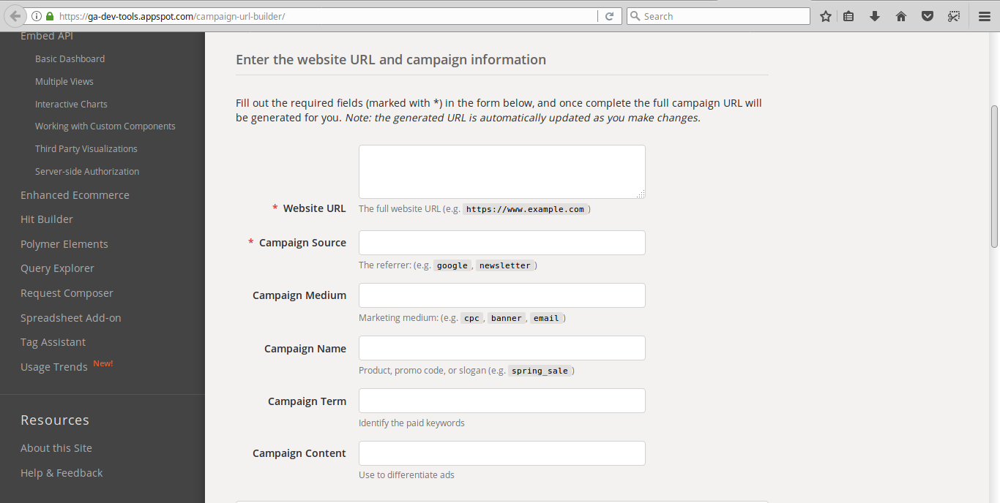
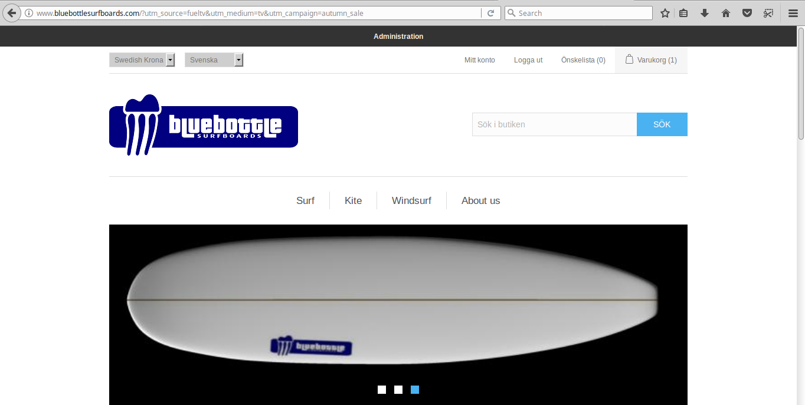
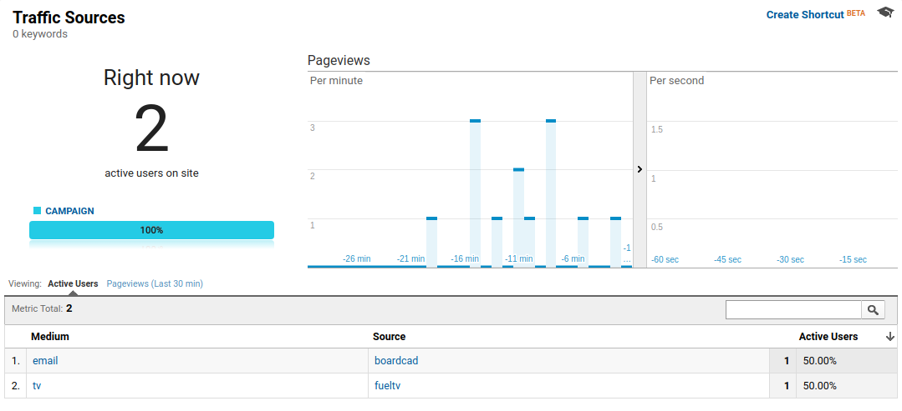
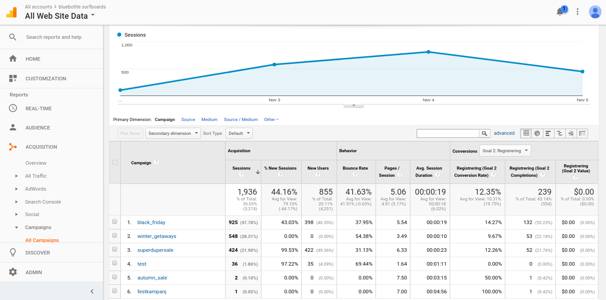
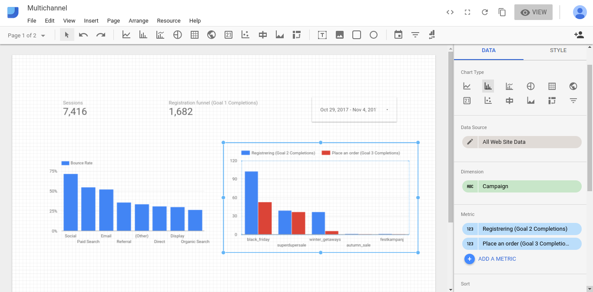

# Steg 3: Campaign/acquisition tracking

När vi kommit så här långt är det dags att börja fokusera på marknadsföringskanalerna. Bara för att vi implementerat Google Analytics så innebär det inte att vi automatiskt kan tracka saker som email, affiliate, sociala medier, adwords, och andra kampanjer. För samtliga (utom adwords) behöver vi lägga till speciella tracking parametrar i länkarna, så kallade UTM-taggar (Urchin Tracking Module).

## Länkar

För att skapa UTM-taggade länker så kan vi använda ett verktyg som Google Campaign URL Builder: 

https://ga-dev-tools.appspot.com/campaign-url-builder/ 

De obligatoriska fälten här är:

- Website URL – Landningssidan för vår kampanj, t.ex. http://www.bluebottlesurfboards.com eller en specifik produktsida http://www.bluebottlesurfboards.com/bluebottle-s4 
- Campaign Source – Källan där kampanjen visas, t.ex. facebook, twitter, newsletter

Man bör också fylla i följande:

- Campaign Medium – Vilken typ av kampanj som används, t.ex. email, CPC, banner
- Campaign Name – Ett namn som tydligt identifierar den aktuella kampanjer, t.ex. black friday
 
Slutligen kan man även skicka med följande:

- Campaign Term – Används främst för att identifiera betalda sökord
- Campaign Content – Används främst vid AB-test för att skilja de olika annonsversionerna.

Här är ett exempel på en länk som skapats för att användas för en banner på surfineurope i samband med en höstkampanj: 

http://www.bluebottlesurfboards.com/?utm_source=surfineurope&utm_medium=banner&utm_campaign=autumn_sale 

## Redirects

De skapade länkarna fungerar bra i de allra flesta fall, men ett problem är att de blir väldigt långa. Skall man t.ex. skicka med länken i ett Twitter-meddelande så vill man gärna ha en kortare länk. I Googles verktyg finns möjligheten att skapa upp en s.k. tiny-URL. Detta är en kortare URL som helt enkelt skickar vidare trafiken till den längre URL:en. Med hjälp av detta skapade jag upp följande URL som om man klickar på den tar användaren till den långa länken ovan:

https://goo.gl/RAHsNJ 

I andra fall kan det vara viktigare att länken är lätt att komma ihåg än att den är kort. Detta kan t.ex. vara fallet om man vill använda denna vid marknadsföring i andra medier än på webben, t.ex. i TV, radio, eller i en tidning. Skapar vi en TV-kampanj kan vi t.ex. uppmana tittarna att gå in på:

www.bluebottlesurfboards.com/tv 

Sedan kan vi själva se till att göra en redirect därifrån med en UTM-taggad länk, t.ex.

http://www.bluebottlesurfboards.com/?utm_source=fueltv&utm_medium=tv&utm_campaign=autumn_sale 

Hur man gör en URL-redirect beror lite på vilken plattform man använder. Här använder vi nopcommerce och då finns det ett plugin som sköter detta:

https://www.nopcommerce.com/p/2363/simple-301-redirect.aspx 

När man har installerat pluginet kan man skapa en fil 404.txt som innehåller de mappningar man vill ha. Lägger vi till:

/tv <-> /?utm_source=fueltv&utm_medium=tv&utm_campaign=autumn_sale

Får vi en redirect från /tv till startsidan med taggarna för vår kampanj som då kommer att skickas till Google Analytics så att vi vet att trafiken troligtvis kommer ifrån någon som har sett TV-reklamen.

## Analys av kampanjer

Vi kan se resultatet av våra UTM-taggade länkar direkt i Google Analtics realtidsvy:

För att kunna analysera dem ytterligare behöver vi vänta på att Google Analytics har bearbetat vår data och gjort den tillgänglig i rapporterna…

Nedan visas en kampanjrapport efter det att ovanstående data behandlats.

Ur denna kan vi direkt se hur många sessions som kommit från varje kampanj, bounce rate för dessa, samt engagemang och konverteringsgrad för de olika kampanjerna.

Vi kan nu uppdatera vår dashboard och t.ex. lägga till information om hur många registreringar (Goal 2) eller köp (Goal 3) som respektive kampanj bidrar med.

Detta ger oss en snabb överblick av hur väl våra olika marknadsföringskanaler fungererar, men antalet ordrar kanske inte är det viktigaste. Någon kampanj kanske marknadsför dyra produkter som vindsurfbrädor, medan en annan kanske marknadsför billigare brädor eller tillbehör. Även om fem fenor är fler än fyra brädor så är kanske det totala ordervärdet intressantare än antalet konverteringar. 

Ett annat problem kan vara att användaren ser kampanjen på en enhet, t.ex. sin mobiltelefon, men att denna sedan gör själva köpet på datorn där hemma och då går direkt till hemsidan istället för via kampanjkoden. I sitt standardutförande klarar Google Analytics inte att tracka användare mellan olika enheter. 

För att lösa dessa problem behöver vi lägga till e-handelstracking och ett user id.

