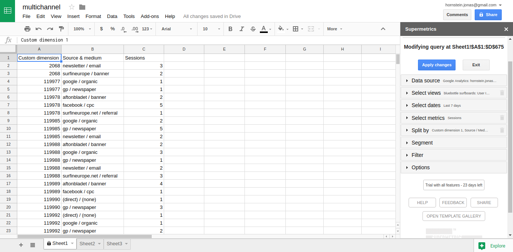
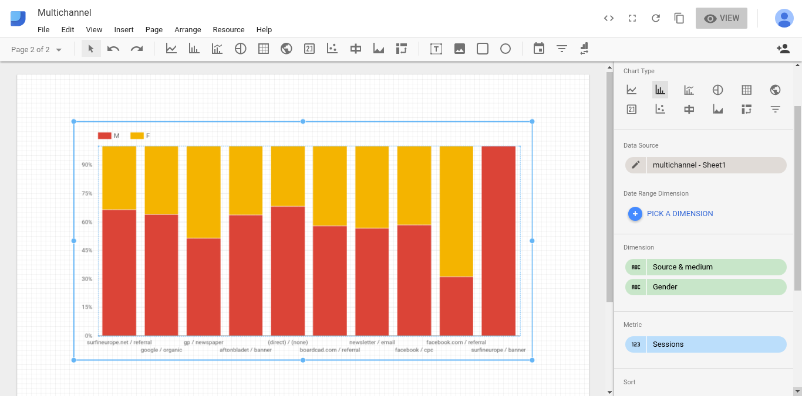

# Steg 4: Revenue and uber-intelligence

Att tagga upp kampanjer kan vara tidskrävande, men är ganska enkelt. Nu har vi kommit fram till det som kräver lite mer komplicerade tracking koder som e-handelstracking och egna variabler så är man inte van vid att programmera så kan det vara läge att försöka arbeta tillsammans med utvecklare/plattformsleverantör för att få sina taggar implementerade. I de här fallen räcker det oftast inte med att bara lägga till kod i JavaScript utan underliggande data behövs först göras tillgänglig ifrån backend-koden (ofta bestående av Java eller C#).   

## Ecommerce-tracking

Bluebottle Surfboards använder sig av nopcommerce e-handelsplattform. Där är som tur är e-handelstracking redan implementerat i det Google Analytics-plugin som vi använder. Tyvärr är det bara den enklare formen av e-handelstracking som finns tillgänglig i gratis-versionen. Plattformen är visserligen open source så man kan själv lägga till enhanced e-handelstracking om man har tid och kunskap. Alternativt kan man köpa ett plugin för enhanced ecommerce tracking:

http://www.dynamics-consultants.co.uk/solutions/e-commerce/nopcommerce-e-commerce-plugins/dc-google-analytics-with-enhanced-e-commerce 

För den här kursen klarar vi oss dock bra med den enklare formen. Den enkla formen av e-handelstracking skickar enbart data när en order väl har lagts. Då skickas information om vilka produkter som har köpts, pris för de individuella produkterna samt ordertotalen.

Enhanced ecommerce innebär att man kontinuerligt skickar information till Google Analytics så fort en produkt visas i en produktlistning, när besökaren tittar på produktdetaljer, när en vara läggs i varukorgen, samt naturligtvis även när själva ordern görs.

## Egna variabler / User Id

I webbanalys-kursen tittade vi på hur man kunde skapa upp en egen variabel för att tracka inloggade/icke-inloggade användare. I den här kursen skall vi göra något lite mer avancerat, men också mycket mer användbart, och skapa upp en egen variabel som innehåller User Id för inloggade användare. På så sätt kan vi inte bara skilja på inloggade/icke-inloggade användare utan också se exakt vad en viss användare har gjort på sajten.

I Google Analytics finns det dessutom en speciell funktion för att hantera User Id. Genom att skicka upp ett egen User Id kan man ersätta Google Analytics vanliga Client Id (som är kopplat till en speciell enhet/device via en cookie) som används för att koppla ihop olika sessions.

Skillnaden mellan att använda User Id istället för Client Id är att vi på så sätt kan identifiera en och samma användare även om flera olika enheter används. En användare kanske först besöker sajten via mobiltelefonen, men sedan väljer att slutföra köpet hemma på datorn. Med Client Id har vi ingen möjlighet att se att det är samma användare som besökte sajten vid båda tillfällena, vilket vi däremot kan göra med User Id (förutsatt att användaren faktiskt är inloggad både på mobilen och hemma på datorn). Detta har t.ex. betydelse för hur flera av rapporterna i Google Analytics sammanställs, t.ex. hur attribution tilldelas vilket är en viktig del i multikanalsanalys. Läs gärna mer om hur User Id fungerar på https://support.google.com/analytics/answer/3123662?hl=sv 

Nackdelen med att använda User Id är att endast de hits (pageviews och events) som inträffar när användaren är inloggad tas med i rapporterna. Därför skapar man oftast upp en separat vy där man använder User Id och behåller en standardvy med Client Id.

Man slår på User Id och skapar upp sin User Id vy från admin-vyn i Google Analytics:


User Id funktionen hittar man under Tracking info tillsammans med en extra rad tracking code som man behöver lägga till i sitt befintliga tracking code. Vi kopierar därför in denna i vårt script:

```html
<!-- Google code for Analytics tracking -->
<script>
(function(i,s,o,g,r,a,m){i['GoogleAnalyticsObject']=r;i[r]=i[r]||function(){
(i[r].q=i[r].q||[]).push(arguments)},i[r].l=1*new Date();a=s.createElement(o),
m=s.getElementsByTagName(o)[0];a.async=1;a.src=g;m.parentNode.insertBefore(a,m)
})(window,document,'script','//www.google-analytics.com/analytics.js','ga');
ga('create', '{GOOGLEID}', 'auto');
ga('set','userId','{USERID}'); 
ga('set','dimension1','{USERID}');
ga('send', 'pageview');
{ECOMMERCE}
</script>
```

Notera att man själv behöver se till att generera själva användar-id:t och ersätta texten {USER_ID} med kundens användar-id. Detta måste naturligtvis göras dynamiskt varje gång en användare loggar in eftersom varje kund har ett unikt id. Då användar-id:t inte finns tillgängligt i html-koden så att den direkt kan läsa ut från JavaScriptet så måste detta istället göras i plattformens backend-kod. NopCommerce som används för Bluebottle Surfboards hemsida är skriven i C#. Nedan visas koden som ersätter {USER_ID} med användarens inloggning. Om användaren inte är inloggad kommenterar vi helt enkelt bort raden som skickar User Id till Google Analytics:

```C#
// Push the customer ID into the Analytics script as UserId
if (_workContext.CurrentCustomer.CustomerRoles.Any(cr => string.Equals(cr.Name, "Registered")))
{
	analyticsTrackingScript = analyticsTrackingScript.Replace("{USERID}", _workContext.CurrentCustomer.Id.ToString());
}
else
{
	analyticsTrackingScript = analyticsTrackingScript.Replace("ga('set','userId','{USERID}');", "//ga('set','userId','{USERID}');");
	analyticsTrackingScript = analyticsTrackingScript.Replace("ga('set','dimension1','{USERID}');", "//ga('set','dimension1','{USERID}');");
}
```

 
I koden ovan skickar vi användar-id:t till Google Analytics med två olika metoder; dels som ett User Id och dels som en Custom Dimension. Anledningen till detta är att Google Analytics inte låter oss använda User Id för att segmentera våra rapporter eller exportera detta via sitt API till Data Studio och andra analysverktyg. Detta kan man däremot göra Custom Dimension, medan Custom Dimensions å andra sidan inte kan användas för att aggregera attributionsdata. Detta är alltså anledningen till att vi skickar upp vårt användar-id både som User Id och som en Custom Dimension.

Custom Dimensions var det som vi använda under webbanalys-kursen, men om någon skulle ha glömt hur man lägger till dessa i Google Analytics så gör man det under Property – Custom Dimension i admin-vyn:


Vi har nu sett till att vår webbsajt skickar användar-id och konfigurerat Google Analytics för att ta emot detta samt skapat upp en User Id vy där vi kan se hur våra inloggade användare beter sig på sajten (även om de skulle använda flera olika enheter). Tydligast ser man skillnaden på vår standardvy och User Id-vyn genom att titta i rapporten User Explorer.

I User Id-vyn ser vi våra kundnummer från vårt e-handelssystem:


I standardrapporten ser vi istället Googles client id som är kopplat till en specifik enhet och inte en specifik användare:


## Använda e-handelsdata och user id i analysen

I steg 3 kunde vi analysera vilka kampanjer som bidragit till flest konverteringar mot våra mål, men vi kunde inte avgöra vilken kampanj som bidrog till mest intäkter. I och med att vi nu har implementerat e-handelstracking så har vi automatiskt fått ett nytt mål (e-handel), som vi kan använda för att undersöka vilka kampanjer som leder till högst totalt ordervärde.


Ett annat problem som vi hade i förra avsnittet var att om användare klickade på kampanjen i t.ex. sin mobiltelefon och sedan gjorde köpet på sin dator så hade vi inte längre någon koppling mellan kampanjen och själva konverteringen. Hade vi kunnat följa användarna även när dessa byter enhet borde vi alltså kunna få fler konverteringar kopplade till respektive kampanj. Detta är ju en av de saker som vår User ID view skall lösa åt oss, så låt oss därför titta på motsvarande rapport i denna:


Här kan vi mycket riktigt se att vi faktiskt har fler konverteringar i User ID vyn så trackingen mellan olika enheter verkar alltså fungera.

Med e-handelstrackingen påslagen får vi också tillgång till ett flertal e-handelsspecifika rapporter där vi t.ex. kan se vilka produkter som genererar mest intäkter. Detta kan naturligtvis också delas upp per kampanj för att se vilka kampanjer som ger upphov till mest försäljning av en specifik produkt:


Det kan också vara intressant att undersöka hur vårt User Id påverkar rapporterna under Multi-Channel Funnels. Genom att vi lyckas tracka återkommande besökare på olika enheter så får vi betydligt bättre data i User Id vyn och kan se hur olika kanaler samverkat för att nå en konvertering.


När flera kanaler samverkar till en viss konvertering så finns det många olika s.k. attributionsmodeller som man kan använda för att fördela värdet av den aktuella försäljningen till de olika kanalerna. Standard är att man ger allt värde till den kanalen som användes vid det aktuella ordertillfället. En lite mer rättvis modell är t.ex. Time Decay som låter alla kanaler som varit inblandade i en konvertering få tillgodoräkna sig en viss del av värdet, men får tillgodoräkna sig en större del ju närmare själva konverteringen denna användes. Under Attribution – Model Comparison Tool kan vi undersöka hur det beräknade värdet av våra olika marknadsförings­kampanjer förändras om vi byter attributionsmodell:


## Koppla ihop datakällor med User Id

Förutom de fördelar som vi redan sett med att använda User Id internt för att aggregera data i Google Analytics rapporter, så finns det en annan stor fördel. Genom att det User Id som vi nu har i Google Analytics är samma user id som vi har i vårt e-handelssystem så kan vi använda detta för att koppla ihop data från Google Analytics med övrig kunddata som vi har i vårt e-handelssystem.

Vårt e-handelssystem sparar all data i en databas i Azure (Microsoft molnplattform). Har man en Windowsdator så kan man koppla upp sig mot databasen från Power Bi och antingen direkt läsa över de tabeller man är intresserad av eller använda en SQL-fråga för att läsa ut specifik data från en eller flera tabeller. I vårt fall skulle vi t.ex. kunna vara intresserade av att läsa ut kund-id (user id), kön, och födelsedatum för våra kunder. Detta kan göras med följande SQL-sats:

```sql
select a.EntityId, a.[value], b.[value]  from [dbo].[GenericAttribute] a
  inner join [dbo].[GenericAttribute] b on a.EntityId=b.EntityId
  where a.[key] = 'Gender' and b.[Key] = 'DateOfBirth'
```

Desutom behöver vi anslutningsdetaljer till själva databasen:

```
Data Source=bluebottlesurfboards.database.windows.net;
Initial Catalog=nopCommerce;
User ID=bluebottle;
Password=KingKong123
```

I Power Bi kan vi nu läsa ut vår kunddata genom att välja Get Data – SQL Server database och skriva in anslutningsdetaljer och SQL-fråga:


Låt oss också läsa in lite data från Google Analytics, t.ex. user id, source/medium, och sessions:


I Power Bi är det väldigt lätt att koppla ihop datakällorna. I det här fallet drar vi helt enkelt Entity id ifrån databastabellen och släpper på user id i Google Analytics tabellen för att tala om att dessa hör ihop.


För att förenkla visualiseringen kan vi ibland behöva skapa upp beräknade kolumner. I det här fallet kan det t.ex. förenkla att ha en kolumn med en 1:a för alla användare som är män och en annan kolumn med en 1:a för alla användare som är kvinnor, vilket gör det enkelt att summera dessa. 


Nu kan vi t.ex. skapa upp diagram som enkelt summerar antalet män och kvinnor som kommit från en specifik source/media och visualiserar könsfördelningen för denna:


Låt oss nu titta på hur man kan göra samma sak med Google Data Studio. Tyvärr går detta inte att göra helt automatiskt då man inte kan koppla upp sig mot Microsoft SQL Server från denna. Här blir vi istället tvungna att köra SQL-frågan i t.ex. SQL Management Studio och exportera resultatet i en CSV-fil som sedan kan importeras av Data Studio.

Tyvärr verkar det inte heller finnas möjligheter att koppla ihop två datakällor i Data Studio utan detta får istället göras i Google Spreadsheet innan tabellerna läses in i Data Studio. Arbetsgången blir alltså att importera både Google Analytics data och kunddata i Google Spreadsheets och sammanlänka denna där innan den laddas in i Data Studio för att visualiseras.

Vi börjar med att läsa in data från Google Analytics i Google Spreadsheets med hjälp av supermetrics plugin:



Vi hämtar sedan in kunddata från vår CSV-fil i en ny flik, och lägger till våra beräknade kolumner i denna:


Vi kan nu gå tillbaka till första fliken och koppla in data från Sheet2 i denna genom att matcha Custom dimension 1 i Sheet1 mot EntityId i Sheet2:


Nu har vi kopplat ihop vår kunddata med data från Google Analytics i Google Spreadsheets och kan läsa in denna i Data Studio. Detta görs genom att skapa upp en ny datakälla under Resource – Manage added data sources. Välj Google Spreadsheets och välj sedan din fil och använd Sheet1 som tabell. Vi kan nu använda tabellen för att skapa upp ett diagram över könsfördelningen för våra source/media.



## Lite statistik...
 
I diagrammet ovan kan vi se att kampanjen på facebook/cpc verkar dra fler kvinnor till sajten jämfört med t.ex. aftonbladet/banner. Kan vi vara säkra på detta eller är det en slumpmässig variation? Innan vi vågar dra några slutsatser så vill vi kontrollera så att den här skillnaden är statistiskt säkerställd med hjälp av ett t-test.

Vi sätter därför upp en noll-hypotes med antagandet att andelen kvinnor är samma för besökare som kommer från facebook/cpc och för besökare som kommer via aftonbladet/banner.

Vi läser först in användarna som kommer från facebook/cpc, kopplar dessa mot vårt kundregister, och skapar en beräknad kolumn som innehåller 1 om användaren är kvinna och 0 om användaren är man:


Vi gör detta i samma kalkylark som tidigare och skapar en ny flik Sheet3 och läser in data från Google Analytics med supermetrics plugin och följande inställningar:

```
View: Bluebottle surfboards User Id view
Dates: Last 7 days
Metrics: Sessions
Split to rows: Custom dimension 1, Source/Medium
Filter: Source/Medium equals to ”facebook / cpc”
```

Gender, DateOfBirth, Male, och Female har vi redan i Sheet2 så vi hämtar dessa därifrån genom att matcha Custom Dimension 1 i Sheet3 mot EntityId i Sheet 2 vilka innehåller våra kundnummer. Detta görs som tidigare med formeln:

```
=INDEX(Sheet2!B:B,MATCH($A2,Sheet2!$A:$A,0))
```

(Eftersom vi redan tagit fram de beräknade kolumnerna Male och Female behöver vi inte beräkna dessa på nytt i Sheet3.)

Kolumnen G (Female) visar nu distributionen av kvinnor för användarna som kommer från facebook/cpc.

Vi gör nu samma sak för användarna som kommer från aftonbladet/banner genom att göra en ny inläsning från Google Analytics i rutan I1 med samma inställningar som tidigare, förutom att vi nu filtrerar på aftonbladet/banner:

```
View: Bluebottle surfboards User Id view
Dates: Last 7 days
Metrics: Sessions
Split to rows: Custom dimension 1, Source/Medium
Filter: Source/Medium equals to ”aftonbladet / banner”
```

Kunddata hämtas på nytt från Sheet2 genom att klicka i rutan med formeln:

```
=INDEX(Sheet2!B:B,MATCH($I2,Sheet2!$A:$A,0))
```

Under kolumnen O (Female) visas nu distributionen av kvinnor för användare som kommer från aftonbladet/banner.

Vi kan nu skapa ett t-test genom att klicka i rutan Q2 och ange följande formel:

```
=TTEST(G2:G89,O2:O184,2,2)
```

där G2:G89 pekar ut värdena från facebook/cpc, O2:O184 pekar ut värdena från aftonbladet/banner, den första 2:an talar om att vi använder 2-tail, och den andra 2:an att det är oberoende variabler och inte något parat t-test.

Resultatet av vårt t-test blir i det här fallet 0.00005063008664, vilket är mindre än 0.05 och vi kan alltså med 95% säkerhet förkasta vår noll-hypotes. Vi kan alltså med åtminstone 95% sannolikhet säga att det facebook-kampanjer lockar fler kvinnor till sajten än kampanjen på aftonbladet.

Nedan visas hur vårt t-test ser ut i Google Spreadsheets:


Laborera gärna med att göra t-testet med mindre data, genom att ändra hur många rader som tas med i testet. I det här fallet behöver vi ca 40 mätvärden för att få ett statistiskt säkerställt resultat…

