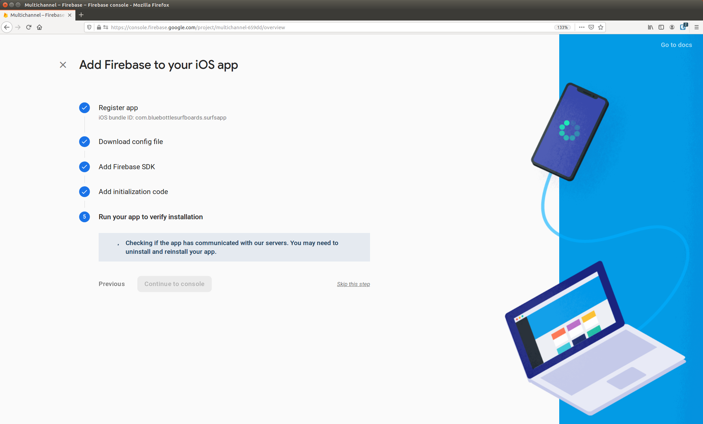

# Step 5: Rich-media tracking

Nu har vi kommit fram till det sista steget i Avinash ”ladder of pain / steps to nirvana”, vilket består av att tagga upp events på själva webbsidan samt att skicka in data från externa appar och applikationer.


## Mobila appar

Vi börjar med att kolla på hur man samlar in och analyserar data från mobila appar. 

För att tracka mobila appar kan man använda Firebase SDK. Detta ingår automatiskt om man använder Android Studio och finns även för iOS-appar. Firebase fungerar ungefär som Google Analytics spårningskod för webbsajter och skickar information om antalet nedladdningar, antalet användningar, events, och konverteringar. Firebase data kan analyseras i Firebase Analytics (heter numera Google Analytics for Firebase) eller direkt i Google Analytics genom att man skapar upp en mobil-app property:


Precis som för Google Analytics så finns det ett demo-projekt för Firebase Analytics:

https://support.google.com/firebase/answer/7157552 

Jag har inte kollat om man kan komma åt detta inifrån Google Analytics, men man kommer i alla fall åt det från Firebase Analytics:


Rapporterna i Firebase Analytics och de i Google Analytics property för mobilappar skall vara identiska. Det går dock inte att samköra data från en mobilapp och en webbsida i varken Firebase Analytics eller i Google Analytics utan man behöver i så fall använda t.ex. Data Studio.

Det finns i dagsläget ingen färdig connector för att ansluta sig till Firebase ifrån Data Studio utan man behöver använda Big Query för detta.

För att kunna testa att skicka data från en mobilapp till Firebase, samt från Firebase till BigQuery (och vidare till Data Studio), så har vi tagit fram en enkel app för Bluebottle surfboards.

### Bluebottle SurfsApp

SurfsApp är en enkel väderapp för Android som och visar vindstyrka och riktning baserat på telefonens nuvarande position. Nedan visas en bild från Android Studio som används för att ta fram appen. Den som är intresserad kan hitta källkoden till SurfsApp på https://github.com/hornstein/surfsapp och öppna denna i Android studio för att testköra appen på datorn eller ladda över den till telefonen:


Så här ser själva applikationen ut när den körs:


### Samla in data

Vi kommer inte att gå igenom källkoden i detalj utan tittar enbart på de delar som samlar in data och skickar denna till Firebase analytics. Vi börjar med insamlingen av data. Det vi är intresserade av här är främst tre saker: användar-id, geografisk data, samt väderinformation.

För att kunna knyta ihop våra app-användare med besökarna på vår webbsajt behöver vi använda oss av samma inloggning i både appen och på webbsajten. Vår webbsajt bygger på e-handelsplattformen nopCommerce som har en inbyggt login-funktion. Det finns ett API som gör det möjligt att komma åt plattformen från t.ex. en mobilapp: https://github.com/SevenSpikes/api-plugin-for-nopcommerce. Detta är dock under utveckling och i nuläget kommer man fortfarande inte åt login-funktionaliteten via API:t. Plattformen bygger visserligen på öppen källkod så man skulle själv kunna implementera detta, men här kommer vi istället att fejka vår user-id. 

Låt oss istället titta på hur vi läser ut geografisk data. En av de stora fördelarna med en mobilapp är att användaren bär med sig mobilen i fickan och att appen därför kan läsa av hur användarna rör sig och när de befinner sig i närheten av t.ex. en fysisk butik för att skicka erbjudanden baserat på detta eller helt enkelt lära sig mer om användarens beteende. Det finns två sätt att läsa ut geografisk information, antingen genom att använda COARSE_LOCATION som baseras sig på data från mobilnätverket eller via FINE_LOCATION som använder sig av GPS-data. GPS-data är betydligt mer exakt, men drar mycket batteri så behöver man inte precisionen så är det bättre att nöja sig med informationen från nätverket. För att få spåra geografisk data behöver man ha användarens tillåtelse att göra detta:

```Java
LocationManager locationManager = (LocationManager) getSystemService(Context.LOCATION_SERVICE);
MyCurrentLoctionListener locationListener = new 
    MyCurrentLoctionListener(myAwesomeTextView, queue, mFirebaseAnalytics);
if (ActivityCompat.checkSelfPermission(this,         
    Manifest.permission.ACCESS_FINE_LOCATION) != 
    PackageManager.PERMISSION_GRANTED 
    && ActivityCompat.checkSelfPermission(this, 
    Manifest.permission.ACCESS_COARSE_LOCATION) != 
    PackageManager.PERMISSION_GRANTED) 
{
    // TODO: should requestPermissions...
    myAwesomeTextView.setText("Permission denied...");
    return;
}

locationManager.requestLocationUpdates(LocationManager.GPS_PROVIDER, 0, 0, locationListener);
```

Här kollar vi först att vi har tillåtelse att läsa av GPS-data och registrerar sedan en lyssnare som anropas när användaren flyttar sig. För vår app vill vi använda denna informationen för att läsa ut väderdata för den aktuella positionen:

```Java
public void onLocationChanged(Location location) {
    double latitude=location.getLatitude();
    double longitude=location.getLongitude();

    final String url = "https://opendata-download-metfcst.smhi.se/api/category/pmp3g/version/2/geotype/point/lon/" + String.format(Locale.US, "%.2f", longitude) + "/lat/" + String.format(Locale.US, "%.2f", latitude) + "/data.json";

        // prepare the Request
        JsonObjectRequest getRequest = new JsonObjectRequest(Request.Method.GET, url, null,
                new Response.Listener<JSONObject>(){
```

I koden ovan läser vi ut latitud och longitud från mobiltelefonen och anropar sedan SMHI för att få reda på vädret för den aktuella positionen. Väderdata kommer som ett JSON-objekt ur vilket vi kan parsa ut vindstyrka och vindriktning. Vi går inte igenom exakt hur detta görs utan den intresserade läsaren får själv hämta hem källkoden eller läsa dokumentationen från SMHI:

https://opendata.smhi.se/apidocs/ 


### Skicka data till Firebase analytics

Mobilappar skiljer sig från webbsajter. Webbsajter är ofta uppdelade på ett antal sidor som användaren navigerar mellan (även om det blir allt vanligare med mer dynamiska sidor där innehållet laddas allt eftersom användaren interagerar med sidan). När besökaren navigerar mellan olika sidor skickar man normalt PageView-hits till Google Analytics och eventuellt skickar man även en del events i de fall där användaren gör något specifikt på sidan utan att detta resulterar i en ny sidladdning. En mobilapp är inte uppbyggt av ett antal olika sidor på samma sätt som en webbsida, utan för mobilappar handlar det framför allt om att tracka events. 

Som tur var är event-tracking väldigt enkelt med Firebase analytics. Dokumentation om hur man trackar events finns på:

https://firebase.google.com/docs/analytics/android/events 

Precis som för Google Analytics finns det en del fördefinierade events, som t.ex. e-handels event, samt möjligheten att definiera egendefinierade events. Totalt kan man definiera upp till 500 egna events och koppla upp till 25 egna parametrar till var och en av dessa.

För vår app tänker vi oss att vi vill generera events när en användare är i närheten av någon känd surfstrand och att vi då vill skicka data om strandens namn, användarens id, vindriktning, samt vindstyrka.

Det första vi behöver göra är att lägga till Firebase till vår app. Använder man Android Studio för att utveckla sin app så kan detta göras direkt från menyn under Tools – Firebase. Klicka på Analytics och ”Connect your app to Firebase”:


Vi behöver också initiera Firebase Analytics i vår app:

```Java
private FirebaseAnalytics mFirebaseAnalytics;
mFirebaseAnalytics = FirebaseAnalytics.getInstance(this);
```

Bara genom inkludera Firebase Analytics får vi automatiskt tillgång till data om nedladdningar och försäljningsstatistik för vår app ifrån Google Play, samt varifrån våra användare kommer och vilka enheter de använder.

Vi kan nu generera ett event med följande kod:

```Java
Bundle bundle = new Bundle();
bundle.putString("user_id", "1");
bundle.putString("spot", "apelviken");
bundle.putString("wind_direction", wdstring );
bundle.putString("wind_speed", wsstring );
mFirebaseAnalytics.logEvent("surf_session", bundle);
```

Här skapar vi först upp de parametrar som vi vill skicka med vårt event i form av key-value par. Att använda custom-parametrar är betydligt enklare än att definiera custom dimensions i Google Analytics. Här anger vi bara parameterns namn, t.ex. user_id, samt dess värde (i det här fallet ”1”). I exemplet ovan har vi skapat upp fyra stycken custom parametrar. Den sista raden skickar iväg parametrarna tillsammans med ett custom event som vi kallar för surf_sessions.

### Firebase Analytics

Nu har vi en app som loggar data till Firebase Analytics så låt oss logga in i Firebase och kolla hur vi hittar vår data i denna. Vi hittar Firebase Analytics på:

https://console.firebase.google.com 


Här hittar vi dels demoappen som vi har tittat på tidigare, dels SurfsApp som vi skapade i förra avsnittet.

**Events**

Vi klickar på SurfsApp och sedan på Events under Analytics för att se våra events:


Vi ser att vi förutom vårt custom event ”surf_session” även har fått en del standardevents, t.ex. när appen har öppnats för första gången och när den har avinstallerats.

Genom att klick på ett av event-namnen så kommer vi till en detaljerad rapport över det aktuella eventet. Denna rapport innehåller som standard bland annat demografisk och geografisk data, men vi saknar våra custom parametrar. För att få med dessa i rapporten behöver vi klicka på de tre punkterna längst till höger och får då upp ett fönster där vi kan lägga till de parametrar vi vill se i rapporten. Här har jag valt att se samtliga custom parametrar, d.v.s. spot, user_id, wind_direction, och wind_speed.


Vi kan nu se våra parametrar i den detaljerade rapporten:


Våra event är egentligen det enda som är intressant för oss. Tyvärr visar Firebase bara aggregerad data på samma sätt som Google Analytics och vi har ingen möjlighet att se exakt vad varje enskild användare har gjort direkt ifrån Firebase Analytics. Som tur är går det att exportera rådata från Firebase Analytics till BigQuery, men innan vi tittar på det så tar vi en snabb titt på de övriga rapporterna i Firebase Analytics.

**Audiences**

Under audiences hittar vi olika användargrupper som kan vara intressanta att analysera var för sig. Vi kan också skapa upp egna användargrupper. Här har jag skapat upp en användargrupp för surfare vilken definieras som användare som har besökt minst ett surfställe.


**Attribution**

Under attribution ser vi de events som vi markerat som conversion goals under event-menyn. Under network settings kan vi sedan se vilka källor som har drivit trafiken till appen i samband med konverteringen. 


**Funnels**

Under Funnels kan vi definiera konverteringstrattar. Dessa är ganska begränsade. Det går inte att lägga till custom events i dessa och trattarna är helt öppna – de visar enbart hur många av varje event som inträffat, utan att ta hänsyn till om föregående steg har passerats eller inte.


**Cohorts**

Cohorts visar hur stor andel av användarna som kommer tillbaka efter ett visst antal dagar/veckor/månader. 


**StreamView**

Den sista rapporten som jag tänkte nämna är StreamView-rapporten. Denna motsvarar i princip realtidsvyn i Google Analytics, men en viktig skillnad mellan mobiltracking och tracking av webbsidor är att mobiltelefonerna inte alltid skickar data i realtid, vilket gör att StreamView rapporten inte riktigt visar events i realtid. Detta kan vara ett problem när man håller på att testar tracking koden då mobiltelefonerna kan hålla inne på eventsen i ett par timmar innan den beslutar sig för att skicka iväg dem. Enda säkra sättet att få den att skicka iväg data till Firebase direkt verkar vara att avinstallera appen...


### Firebase Analytics i Google Analytics

Det går numera även att titta på sin Firebase Analytics data direkt i Google Analytics, men rapporterna ser fortfarande ut precis som i Firebase Analytics och inte som de Google Analytics rapporter vi är vana vid. 

Vi kan inte heller använda oss av några segment eller andra saker som vi skapat upp i Google Analytics när vi kollar på vår mobildata, utan vår Firebase data är helt frikopplad från övrig Google Analytics data.

Tyvärr innebär detta också att vi inte kan använda våra vanliga Google Analytics connectorer för att föra över mobildata från Firebase till t.ex. Data Studio eller Power BI, trots att vi kan titta på vår data inne i Google Analytics. Faktum är att det inte finns någon enkel connector för att läsa över data från Firebase till Data Studio eller Power BI, utan för att kunna göra detta måste vi först exportera vår data till BigQuery...


### Exportera data till BigQuery

Med Firebase Analytics är det möjligt att exportera rådata till BigQuery. Med rådata avser jag hela strömmen av events och inte enbart aggregerad data. För Google Analytics krävs det ett 360-konto för detta vilket innebär en väldigt hög kostnad. Tyvärr är det inte helt gratis med Firebase Analytics heller, men där beror kostnaden på datamängden och har man ett litet testprojekt som detta så rör det sig inte om många kronor. Är man orolig för att kostnaden skall sticka iväg går det även att sätta ett tak så att exporten automatiskt stängs av när taket är nått.

För att kunna slå på export till BigQuery behöver vi därför först uppgradera vår betalningsplan från gratisplanen Spark till Blaze - pay as you go. Detta görs under Settings – Account Linking och där genom att klicka på Upgrade project under BigQuery.


När vi länkat ihop vårt Firebase-konto med BigQuery så kan vi klicka på Manage Linking och sedan på View account för att ta oss till BigQuery.


Så här ser det ut inne i BigQuery:


Redan vid första anblicken ser man att BigQuery är ett ganska tekniskt verktyg, och det krävs åtminstone grundläggande databaskunskaper för att kunna dra nytta av kraften i BigQuery. Är man bara villig att lägga lite tid på att komma över den första tröskeln så är det ett mycket flexibelt och kraftfullt verktyg för att organisera och söka i sin data.

Vi kommer enbart att titta på hur man söker fram information om våra custom events, men vill man få en mer detaljerad genomgång av hur man söker i BigQuery så hittar man det på:

https://cloud.google.com/bigquery/docs/reference/standard-sql/query-syntax 

För att söka fram våra custom events kan man använda följande sql:

```Sql
#standardSQL
SELECT 
  (SELECT params.value.string_value FROM x.params WHERE params.key = 'user_id') AS User_ID,
  (SELECT params.value.string_value FROM x.params WHERE params.key = 'spot') AS Spot,
  (SELECT params.value.string_value FROM x.params WHERE params.key = 'wind_direction') AS Wind_Direction,
  (SELECT params.value.string_value FROM x.params WHERE params.key = 'wind_speed') AS Wind_Speed
FROM 
  `se_bluebottle_surfsapp_ANDROID.app_events_20171202`, UNNEST(event_dim) AS x
where 
  (SELECT params.value.string_value FROM x.params WHERE params.key = 'user_id') is not null
```


## Google Analytics App + Web

Under sommaren 2019 annonserade Google en ny version av Google Analytics som kallas Google Analytics App + Web, med avsikten att få ett gemensamt sätt att samla in och hantera data från både mobila appar och webben: 

https://blog.google/products/marketingplatform/analytics/new-way-unify-app-and-website-measurement-google-analytics/

Denna finns nu tillgänglig i en Beta-version och innehåller en hel del som är intressant, särskilt för de som vill samordna analysen av trafik från en mobil app och en webbsida, men även för de som enbart har en webbsida. Google Analytics App + Web grundar sig på Firebase så vi kommer att känna igen det mesta av gränssnittet från Firebase analytics, och kan nu dra nytta av den enklare hanteringen av händelser/events, samt möjligheten att exportera rådata till BigQuery. Detta var något som tidigare enbart var möjligt från Google Analytics för de med 360-konto. Samtidigt saknas en del saker i Google Analytics App + Web som finns i den vanliga versionen av Google Analytics. T.ex. så saknas det ett reporting API, så precis som för Firebase kan vi inte direkt läsa över data i Data Studio eller Google Sheets, utan måste gå omvägen till BigQuery. Även i analysdelen saknas en del rapporter från Universal Analytics som E-commerce och site search. Den allmänna rekommendationen i nuläget är därför att inte direkt gå över till Google Analytics App +  Web, utan istället köra båda parallellt. Använder man Tag Manager är det som tur var väldigt enkelt att skicka sin Web-data till två (eller fler) olika analysverktyg. Nedan går vi igenom hur man sätter upp Google Analytics App + Web.

Det första man skall göra är att skapa upp ett nytt projekt i Firebase:


Här skapar vi upp ett projekt som heter Multichannel:


Vi får då möjligheten att koppla detta till Google Analytics, vilket vi väljer att göra:


I nästa steg får vi välja vilket Google Analytics konto vi vill använda:


I nästa steg skall vi skapa upp en app. Det bästa verkar vara att välja att antingen en iOS app eller en Android app även om vi inte har en sådan. Detta för att loggningen av rådata till BigQuery skall fungera. 


Vi behöver sedan klicka förbi alla stegen tills vi kommer till att verifiera vår app. Eftersom vi inte har någon iOS-app väljer vi "Skip this step":



Vi kan nu gå in i Google Analytics och hittar den nya propertyn som skapats upp för Google Analytics App + Web. Notera att det inte finns några vyer för den här propertyn så vi kan inte filtrera bort trafik direkt från vyn utan vill vi filtrera bort trafik får detta göras direkt från rapporterna.

Vi vill nu få propertyn att samla data från både vår app och vår webbsida. Detta konfigureras under Data Streams. Här kan vi lägga till en ny stream för Web:


En kul feature är att vi kan automatiskt kan logga events som Scroll och utgående länkar, vilket tidigare krävde manuell taggning från Tag Manager. 


Det enda vi behöver göra för att få igång datainsamligen är att lägga in taggnings-scriptet på hemsidan. Vi kommer att göra detta från Tag Manager, men för att inte missa några events i rådatan till BigQuery går vi först tillbaka till Firebase och slår på integrationen till BigQuery. Detta görs under settings - integrations, genom att välja BigQuery och klicka på link: 


Precis som för vanliga Firebase behöver vi dock uppgradera vår faktureringsplan till Blaze för att kunna exporta events:


## Övriga applikationer

För andra typer av applikationer som kan tänkas vilja skicka data till Google Analytics så finns det ett Measurement Protocol som kan användas att skicka data via ett vanligt http-request, genom att man postar sin data till http://www.google-analytics.com/collect. 

En lista över de olika parametrar som kan skickas med finns på:

https://developers.google.com/analytics/devguides/collection/protocol/v1/parameters 

Det finns också en applikation, Hit Builder, där man enkelt kan bygga sina anrop, ungefär som Googles URL builder. Du hittar Hit Builder på:

https://ga-dev-tools.appspot.com/hit-builder/ 

De obligatoriska parametrarna är:

- v: versionnummer (i nuläget 1)
- t: typ av hit som skall skickas (t.ex. pageview, event,…)
- tid: Tag id för den property som vi vill skicka data till (UA-XXXXX-Y)
- cid eller uid: ett client-id eller user-id. 

Under webbanalys-kursen testade vi att lägga in spårning via Measurement protokollet för en bot:


Koden för detta visas nedan:

```Python
@app.route('/exjobb', methods=['PUT'])
def post_url():
    url = request.json['url']
    r = requests.get(url)
    #save file with unique filename
    unique_filename = str(uuid.uuid4()) + ".jpg"
    filename=os.path.join("archive/",unique_filename)
    fh = open(filename, "wb")
    fh.write(r.content)
    fh.close()
    #tell tsff to find similar product images 
    filename=os.path.join("archive/","tsff_front2back")
    f2 = open(filename, "w")
    f2.write("imgSearch2;c:\\\\inetpub\\\\flaskbot\\\\archive\\\\" + unique_filename + ";12;ClothingType,Silhouette,Pattern,Color,Template;1,1,2,2,2;None;\n")
    f2.close()
    #read similar products
    time.sleep(10)
    filename=os.path.join("archive/","tsff_back2front")
    f3 = open(filename, "r")
    text = f3.read()
    res = re.search(unique_filename + ';\.\/images\/(.+?\..{3})', text)
    if res:
        filename = res.group(1)
    else:
        filename = "error.jpg"
    f3.close()
    url='http://cloud.bluebottle.se/archive/'+filename
    #send data to google analytics
    data = {
        'v': '1',
        'tid': 'UA-85168507-1',
        'cid': '555',
        't': 'pageview',
        'dh': 'cloud.bluebottle.se',
        'dp': '/exjobb',
        'dt': 'Jonas Bot'
    }
    response = requests.post('http://www.google-analytics.com/collect', data=data)
    return jsonify(result=url)
```
Koden som skickar data till Google Analytics startar under raden ”#send data to google analytics”. För er som suttit och analyserat Bluebottle Surboards hemsida i Google Analytics under den här kursen så ringer det nog ett par klockor när ni ser denna. Dels är parametern dp (document path) satt till /exjobb så nu har vi förklaringen till varför denna ser ut att vara den näst vanligaste landningssidan på sajten. Dels använder appen ett hårdkodat värde för client id som alltid är 555. Ni har nog sett detta i User Explorern där det är användaren med flest antal sessioner:


Measurement protokollet kan även användas för att skicka upp e-handelsdata så har man t.ex. ett kassasystem i den fysiska butiken och vill skicka upp offline-försäljningar till Google Analytics så är detta ett lämpligt sätt att göra det på.

