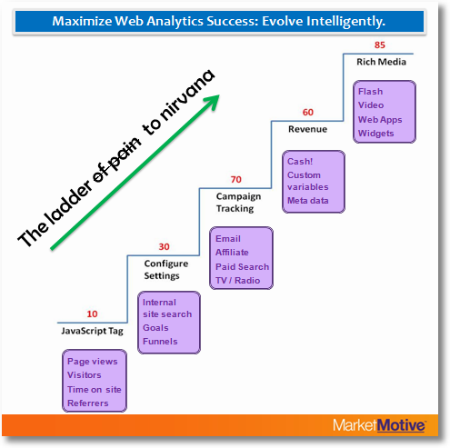

# Stegvis implementering

I det här avsnittet tittar vi på hur man kan samla in data från olika källor som webbplatser, mobilappar, sociala medier och fysiska butiker, och hur man analyserar denna.

Att samla in och analysera webbdata kan i sig vara komplex uppgift, och kommer den dessutom från många olika kanaler så blir det en ännu mer omfattande uppgift. Kommer ni ihåg ”The ladder of pain / steps to nirvana” av Avinash Kaushik? Denna visar hur man stegvis kan införa en effektiv datainsamling i en organisation. Här kommer vi att göra en återblick i de olika stegen.

