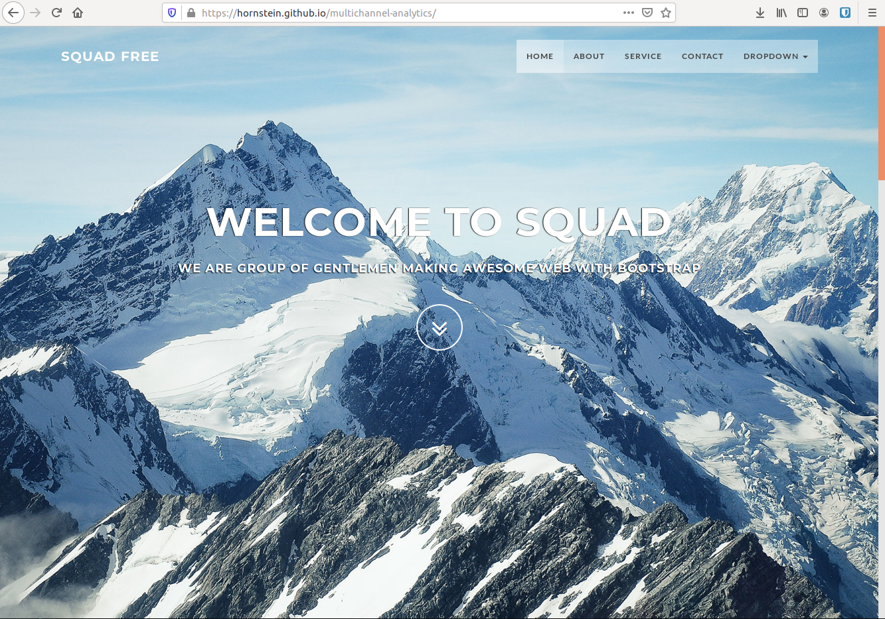

# Skapa testsajt på github

Om man vill laborera med olika metoder för att tagga en hemsida så kan det vara praktiskt att ha en egen sajt att testa med.

## Skapa en sajt

Här kommer vi att använda oss av färdig template för en onepage-sajt:

http://bootstrapmade.com/demo/Squadfree/

Ladda ner denna och packa upp filerna.


## Hosta webbsajten

För att göra sajten tillgänglig från Internet behöver den hostas.

Ett enkelt och gratis sätt att göra detta är att använda GitHub Pages:

https://pages.github.com/

Skapa ett konto på github och följ instruktionerna oven för att:

- Skapa en repository
- Installera git på datorn
- Använda git för att skicka upp vår sajt till repositoryn

Vår sajt skall nu vara online:




## Lägga till Google Analytics tracking kod

Vi behöver nu skapa en ny property i Google Analytics och hämta hem tracking koden.

```html
<!-- Global site tag (gtag.js) - Google Analytics --> 
<script async src="https://www.googletagmanager.com/gtag/js?id=UA-114519476-
1"></script>
<script>
  window.dataLayer = window.dataLayer || [];
  function gtag(){dataLayer.push(arguments);}
  gtag('js', new Date());
  gtag('config', 'UA-114519476-1');
</script>
```

Denna kod lägger vi in i index.html-filen direkt under <head> taggen. Spara filen och pusha denna till repositoryn i github.

Vi skall nu ha en fungerande tracking i Google Analytics.

Med standard-taggen fångar vi PageView-data, men eftersom vi har en onepage-sajt så aktiveras denna 
bara en gång när användaren kommer in till hemsidan och det genereras inga nya PageViews när 
användarna navigerar på hemsidan, och vi får heller någon data om användarna t.ex. fyller i 
kontaktformuläret eller klickar på e-mail-länken.

Nedan går vi igenom hur man själv kan lägga till tracking-kod för att fånga dessa händelser.


## Lägga till PageView-taggar

Vi börjar med att titta på hur man lägger till egna PageView-hits för fånga när användaren navigerar på 
hemsidan. Dokumentation om detta hittas på:

https://developers.google.com/analytics/devguides/collection/gtagjs/single-page-applications

Den tag vi behöver lägga till är:

```javascript
gtag('config', 'GA_TRACKING_ID', {'page_path': '/new-page.html'});
```

där GA_TRACKING_ID är vår tracking kod, i mitt fall UA-114519476-1. Under page_path anger vi 
pathen till den del av sidan som vi vill tracka. En onepage-sajt är ofta uppdelad i olika sektioner som 
man kan navigera till via menyn. Vill man t.ex. komma till About-sektionen så gör man t.ex. det via 
addressen /index.html#about. Den kompletta taggen för About-sektionen på min sida blir alltså:


```javascript
gtag('config', 'UA-114519476-1', {'page_path': '/index.html#about'});
```

Hur lägger vi in denna på hemsidan? Enklaste sättet är kanske att använda en onclick-funktion och 
koppla denna till att någon klickar i menyn (rad 63 i index.html-filen):

```html
<li>
    <a href="#about" onclick="gtag('config', 'UA­114519476­1', {'page_path': '/index.html#about'});">About</a>
</li>
```

Motsvarande kan naturligtvis göras även för övriga menyalternativ. Problemet med detta sätt är att 
PageView-taggen endast aktiveras om någon faktiskt klickar i menyn. Om användaren istället scrollar 
nedåt på hemsidan till respektive sektion så kommer data inte att skickas till Google Analytics. 

Ett bättre, men lite mer komplicerat, sätt att tagga upp sidan är att fånga scroll-event och skicka data när användaren scrollat ner till en viss sektion. Detta fungerar både om användaren använder menyn 
eller om användaren själv scrollar ner till sektionen. Bootstrap ramverket som vår sida bygger på 
innehåller kod för att känna av när man scrollat till en viss sektion så vi kan utnyttja denna för att lägga till vår PageView-tag. Vi hittar koden i filen bootstrap.js under katalogen js. Lägg till PageView-taggen precis ovanför active.trigger('activate.bs.scrollspy') på rad 1653 i filen:

```javascript
gtag('config', 'UA­114519476­1', {'page_path': '/index.html'+target});
```

Här har vi dessutom utnyttjat att det finns en variabel (target) som innehåller namnet på den aktuella 
sektionen (#intro, #about, #services, ...), så vi behöver bara lägga till en enda rad för att generera 
PageViews för samtliga sektioner.

Vi behöver också ändra i index.html så att denna använder sig av filen bootstrap.js istället för den 
minifierade versionen bootstrap.min.js genom att byta ut raden:

```html
 <script src="js/bootstrap.min.js"></script>
```

mot 

```html
 <script src="js/bootstrap.js"></script>
```

Pusha ändringarna till repon för att få in de nya PageView-taggarna på hemsidan.

## Lägga till Event-taggar

Våra hemsidor är framför allt utformade för att få besökarna intresserade av våra tjänster så att de 
kontaktar oss via e-mail eller via det kontaktformulär som ligger på hemsidan.
För att kunna lägga upp dessa som mål i Google Analytics och mäta t.ex. konverteringsgrad, så behöver
vi lägga in tracking-kod som känner av om någon klickar på mailadressen eller på ”Send message” 
knappen. I det här fallet är det inte frågan om någon PageView, utan det vi vill fånga är en specifik 
händelse (event) på hemsidan. Dokumentation om hur man trackar events finns på:

https://developers.google.com/analytics/devguides/collection/gtagjs/events

Detta görs med följande tracking-kod:

```javascript
gtag('event', <action>, {'event_category': <category>,'event_label': <label>,'value': <value>});
```

I den senaste versionen av Google Analytics tracking-kod (gtag) är det endast action som är 
obligatoriskt att fylla i när man genererar ett event. Action är en textsträng som egentligen kan 
innehålla vilken text som helst, men Google rekommenderar att man i första hand använder de Event 
names som finns i dokumentationen ovan. Där hittar man t.ex. generate_lead som kan vara passande 
som action när personer kontaktar oss. Vi får då följande tag:

```javascript
gtag(’event’, ’generate_lead’);
```

Om vi lägger in denna på både kontaktformuläret och e-mail adressen så kan vi dock inte skilja på vilka
användare som använt vilken metod för att kontakta oss. Vill vi göra detta kan vi välja att använda olika kategorier för dessa:

```javascript
gtag('event', 'generate_lead', {'event_category':'Contact us form'}); 
gtag('event', 'generate_lead', {'event_category':'Contact us email'}); 
```

Precis som våra PageView-taggar kan vi lägga in dessa på hemsidan via onclick-funktionen på 
respektive href-tag:

```html
<button type="submit" class="btn btn­skin pull­right" id="btnContactUs" 
onclick="gtag('event', 'generate_lead', {'event_category':'Contact us 
form'});">Send Message</button>
<a href="mailto:#" onclick="gtag('event', 'send_mail', {'event_category':'Contact 
us email'});">email.name@example.com</a>
```

Ett problem med att använda onclick är att events skickas så snart någon klickar på Send Message 
knappen, oavsett om formuläret är korrekt ifyllt eller inte. Helst skulle vi vilja att vi endast får ett event när meddelandet faktiskt skickas. För att åstadkomma detta behöver vi istället lägga till vår event-tag i det javascript som verifierar att formuläret är korrekt ifyllt. Denna hittar vi under 
contactform/contactform.js. Här kan vi lägga till vår gtag under ”else var str = $(this).serialize();” (rad 81):

```javascript
gtag('event', 'generate_lead', {'event_category':'Contact us form'});
```

För vårt email-event finns det tyvärr inget bra sätt att fånga att användaren verkligen skickar mailet 
utan där får vi helt enkelt nöja oss med att fånga de som klickat på email-länken.
